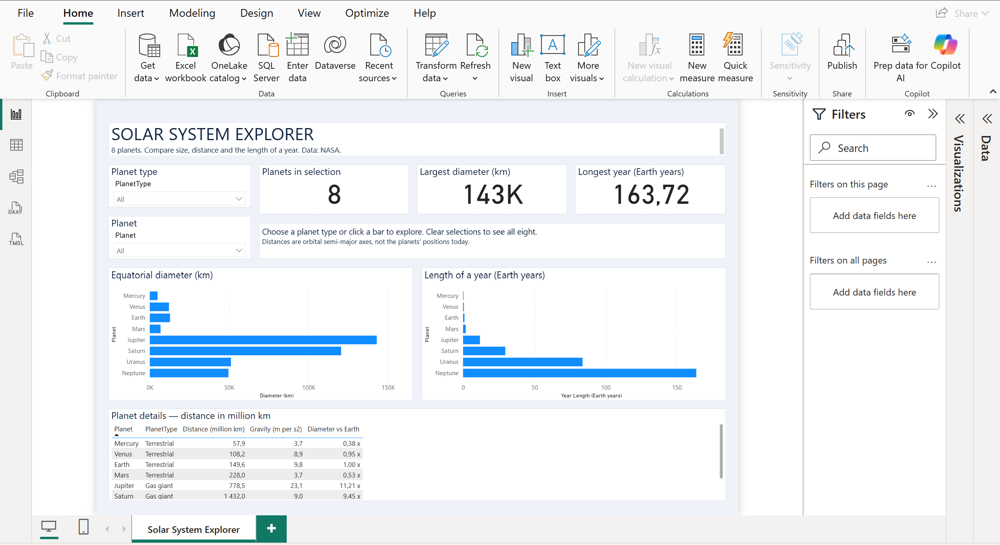

# Solar System Power BI Dashboard

A Power BI project exploring and comparing the eight planets of the Solar System using planetary data from NASA.

The project demonstrates data preparation with Power Query, data modeling, DAX measures, and interactive data visualization in Power BI.

## Dashboard



## Project Goal

The goal of this project is to create an interactive dashboard that allows users to compare the main characteristics of the eight planets in the Solar System.

The dashboard focuses on planetary properties such as size, mass, gravity, temperature, orbital characteristics, and distance from the Sun.

## Tools & Technologies

- Power BI
- Power Query
- DAX
- CSV
- Power BI Project (PBIP)
- Git / GitHub

## Data

The project uses planetary data based on NASA sources.

The dataset contains information about the eight planets:

- Mercury
- Venus
- Earth
- Mars
- Jupiter
- Saturn
- Uranus
- Neptune

The source dataset is available in:

`data/Planets.csv`

## Data Preparation

Power Query was used to:

- import the source data;
- clean and transform columns;
- assign appropriate data types;
- prepare the dataset for analysis;
- load the final table into the Power BI data model.

The Power Query script is available in:

`PowerQuery_Planets.m`

## DAX

DAX measures were created to support dashboard calculations and visualizations.

The measures are available in:

`DAX_measures.txt`

## Dashboard Features

The dashboard allows users to:

- compare planets by physical characteristics;
- analyze differences in size, mass, gravity, and temperature;
- compare orbital and distance-related properties;
- explore planetary data through interactive Power BI visuals.

## Project Structure

```text
solar-system-power-bi/
│
├── SolarSystem.Report/
├── SolarSystem.SemanticModel/
├── data/
│   └── Planets.csv
├── validation/
│
├── DAX_measures.txt
├── PowerQuery_Planets.m
├── SolarSystem.pbip
├── Space-theme.json
├── dashboard.png
└── README.md
